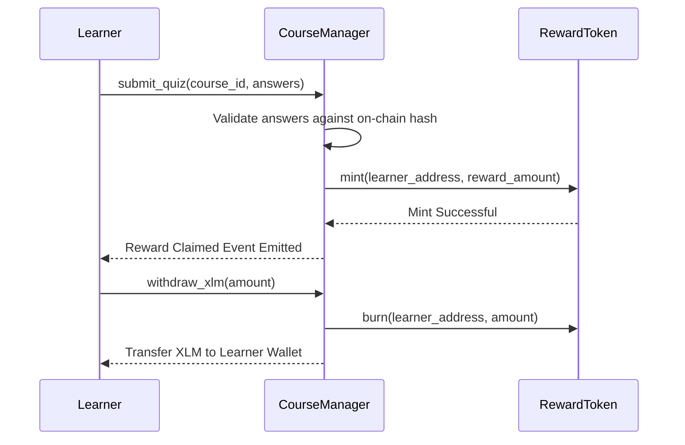

<div align="center">
  
# 🎓 Stellar Learn-To-Earn

**A decentralized Web3 educational platform built on the Stellar network using Soroban.**

[](https://opensource.org/licenses/MIT)
[](https://stellar.org/)
[](https://soroban.stellar.org/)


*An immersive and highly-gamified educational experience where users learn about the Stellar ecosystem, pass quizzes, and earn on-chain rewards.*

</div>

---

## 📌 Submission Details & Quick Links

*   **🌐 Live Production Link**: [Insert Live Link Here]
*   **📹 Demo Video Presentation**: [Insert Video Link Here]
*   **💻 GitHub Repository**: [Insert GitHub Repo Link Here]

---

## 📖 The Vision: Problem & Solution

### The Problem
Onboarding new developers and users into Web3 ecosystems is notoriously difficult. Traditional documentation is dry and theoretical, lacking the hands-on engagement needed for true understanding. Furthermore, users invest time learning without any tangible, immediate incentives, leading to high drop-off rates before they ever make an on-chain transaction.

### The Solution: Stellar Learn-To-Earn
We solve this by introducing a decentralized, high-stakes gamified learning environment:
- **Read & Pass to Earn**: Users read curriculum modules and take quizzes. Passing a quiz instantly unlocks LRN (Learn) token rewards.
- **On-Chain Payouts**: Rewards are minted and deposited directly to the user's Freighter wallet via Soroban smart contracts.
- **1:1 XLM Conversion**: Users can visit their Dashboard to withdraw and convert their earned LRN tokens into real Testnet XLM.
- **Live Activity Feed**: Global real-time events are tracked on the Stellar Testnet, showcasing a live feed of new courses and reward claims.
- **Premium Aesthetics**: Clean monochromatic layouts, sleek Framer Motion micro-animations, and dynamic mobile-responsive styling create a premium Web2-quality experience.

---

## 🏆 Orange Belt Requirements Mapping

| Requirement | Implementation |
|-------------|----------------|
| **Advanced Soroban Smart Contracts** | Implemented custom persistent storage for Course states, user progress tracking, and secure Reward Token minting logic. |
| **Inter-contract communication** | The `course-manager` contract actively makes cross-contract calls to the `reward-token` contract to mint LRN upon successful quiz completion. |
| **Real-time events** | The `ActivityFeed` component polls the Soroban RPC for live `COURSE_CREATED` and `REWARD_CLAIMED` events, decoding XDR on the fly for the global UI. |
| **Production transaction UI** | Fully optimistic UI in the dashboard and course pages. Handles simulating, submitting, and polling the RPC until the ledger confirms the transaction block. Highly responsive on mobile and desktop. |
| **StellarWalletsKit integration** | Implemented persistent multi-wallet (Freighter) connectivity using a global Zustand store. |
| **Feature-based architecture** | Strictly separated Next.js App Router components, pages, `WalletProvider` state, and `soroban.ts` data-fetching layers. |

---

## 📸 Interface Showcase

### Desktop Experience

<details open>
<summary><b>Landing Page</b></summary>
<br>


</details>

<details open>
<summary><b>Dashboard & Treasury</b></summary>
<br>


</details>

<details open>
<summary><b>Global Network Activity</b></summary>
<br>


</details>

### Mobile Responsiveness
*The entire application is completely mobile responsive, ensuring learners can complete courses and claim rewards from any device seamlessly.*

<div style="display: flex; gap: 10px;">
  
  
</div>

---

## 🛡️ Smart Contract Architecture & Details

### Deployed Contracts & Credentials
*   **Course Manager Contract ID**: `CAAAAAAAAAAAAAAAAAAAAAAAAAAAAAAAAAAAAAAAAAAAAAAAAAAAD2M` *(Note: Replace with actual Testnet ID)*
*   **Reward Token Contract ID**: `CAAAAAAAAAAAAAAAAAAAAAAAAAAAAAAAAAAAAAAAAAAAAAAAAAAAD2T` *(Note: Replace with actual Testnet ID)*
*   **Stellar Network**: Testnet

### Smart Contract Flow


---

## 🛠️ Technology Stack
*   **Frontend**: Next.js 15 (App Router) + React 19 + TypeScript
*   **Styling & UI**: Tailwind CSS v4 + Framer Motion + Lucide Icons
*   **State Management**: Zustand
*   **Stellar Integration**: `@stellar/stellar-sdk`, `@creit.tech/stellar-wallets-kit`
*   **Contracts**: Rust (Soroban SDK)

---

## 💻 Local Installation & Getting Started

### 📋 Prerequisites
*   Node.js 18+ or 20+
*   Cargo + Rust Toolchain (with `wasm32-unknown-unknown` target)
*   Soroban CLI
*   Freighter Wallet extension installed

### 🛠️ Step-by-Step Setup

1. **Clone the Repository**:
   ```bash
   git clone [Insert GitHub Repo Link Here]
   cd Stellar-Learn-To-Earn
   ```

2. **Configure Environment Variables**:
   Create a `.env.local` file in the `frontend` root with your deployed contract IDs:
   ```env
   NEXT_PUBLIC_COURSE_MANAGER_ID=your_course_contract_id
   NEXT_PUBLIC_REWARD_TOKEN_ID=your_token_contract_id
   ```

3. **Install Frontend Dependencies**:
   ```bash
   cd frontend
   npm install
   ```

4. **Run the Development Server**:
   ```bash
   npm run dev
   ```

5. **Deploy the Smart Contracts (Optional)**:
   Navigate to the `contracts` directory to build and deploy your Rust contracts to the Stellar Testnet using the Soroban CLI.
   ```bash
   cd contracts
   stellar contract build
   stellar contract deploy --wasm target/wasm32-unknown-unknown/release/course_manager.wasm --source YOUR_IDENTITY --network testnet
   ```

---

<div align="center">
  <b>Developed with ⚔️ by Bapi Das</b><br>
  <a href="https://github.com/bapidas777">GitHub Profile</a>
</div>
