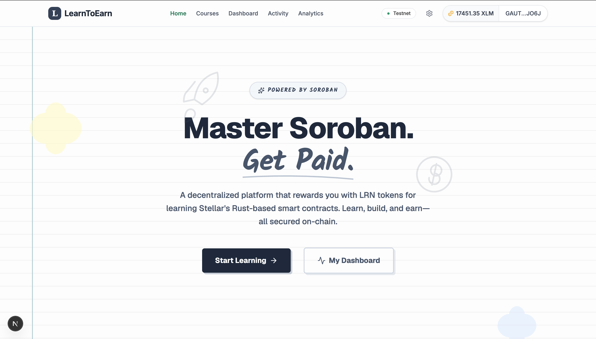
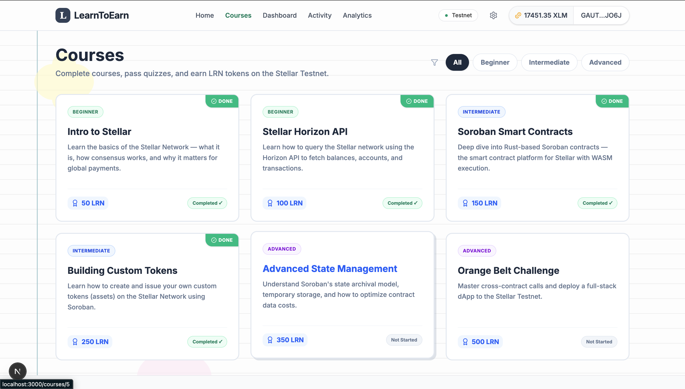
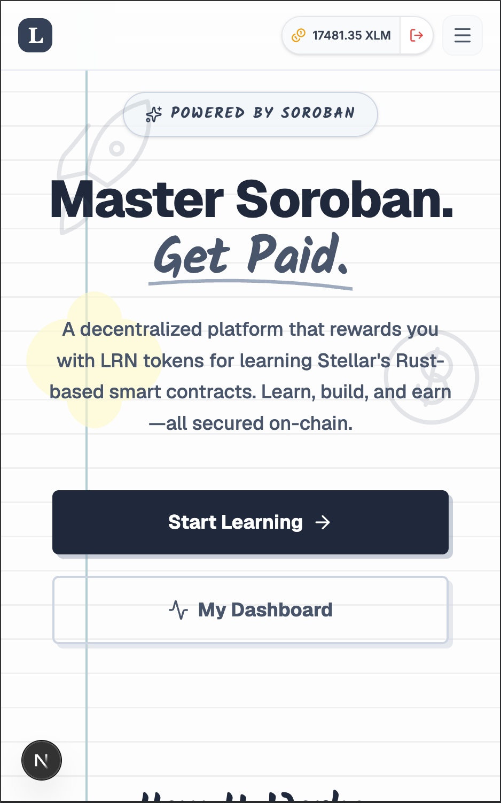
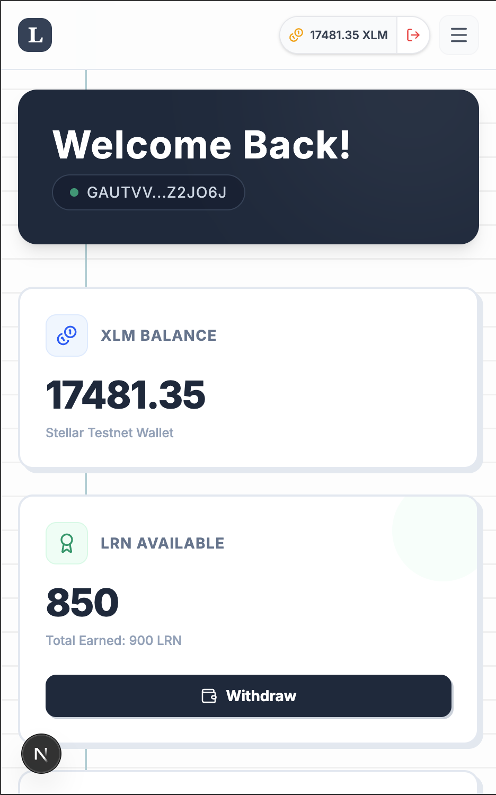
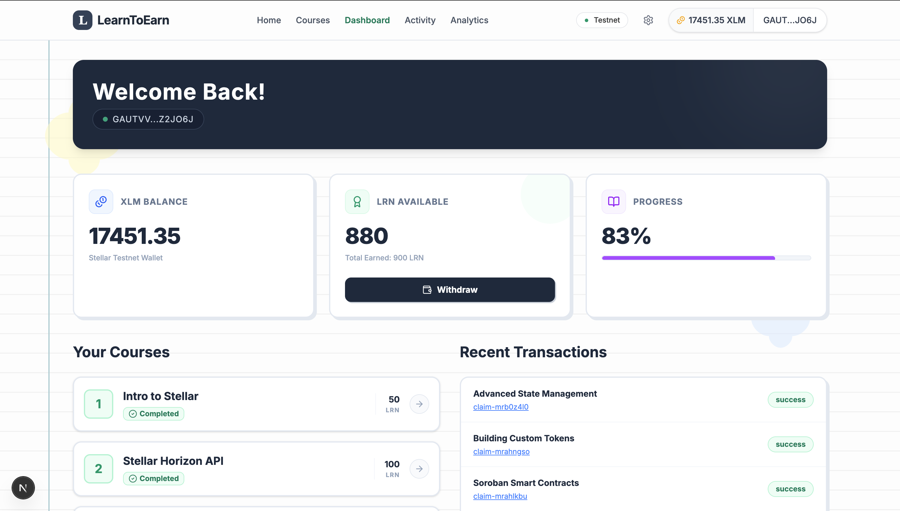
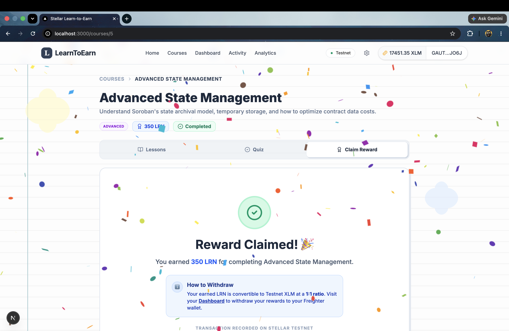
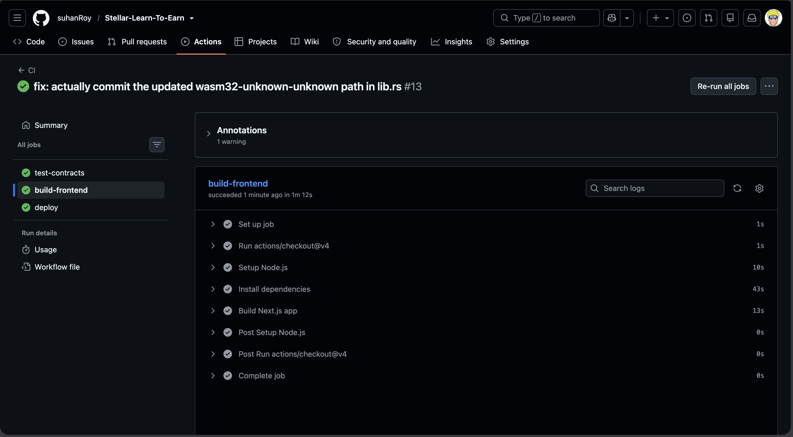
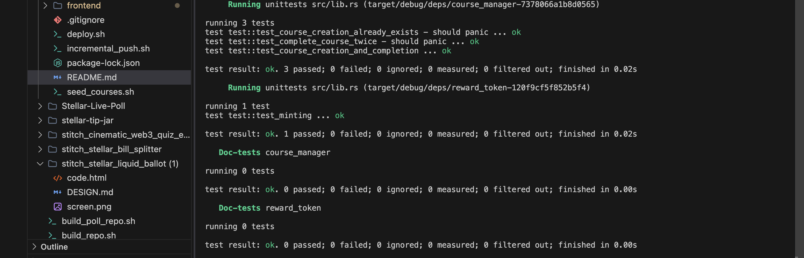
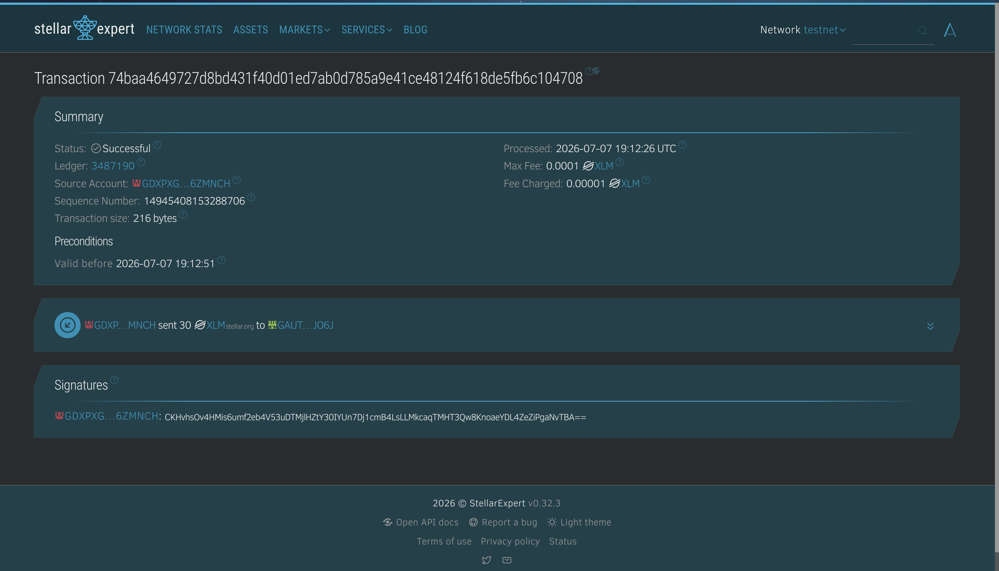
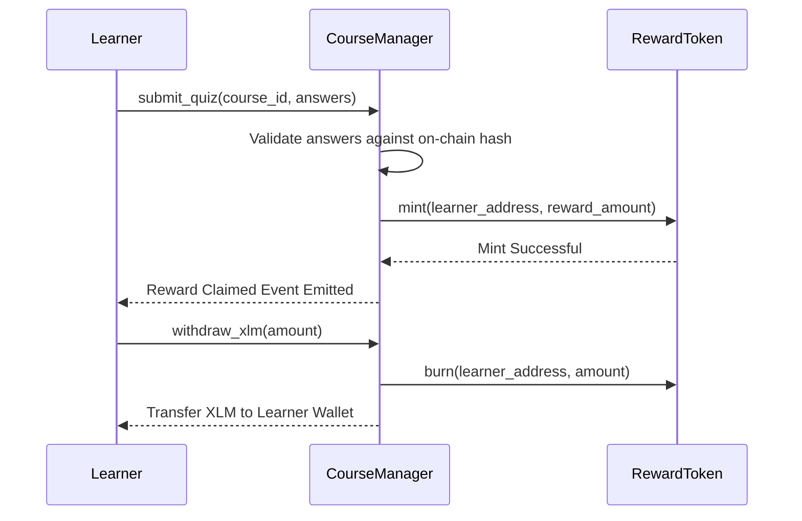

<div align="center">
  
# 🎓 Stellar Learn-To-Earn

**A decentralized Web3 educational platform built on the Stellar network using Soroban.**

[](https://opensource.org/licenses/MIT)
[](https://stellar.org/)
[](https://soroban.stellar.org/)



*An immersive and highly-gamified educational experience where users learn about the Stellar ecosystem, pass quizzes, and earn on-chain rewards.*

</div>

---

## 📌 Submission Details & Quick Links

*   **🌐 Live Production Link**: [Stellar Learn-To-Earn (Vercel)](https://stellar-learn-to-earn.vercel.app/)
*   **📹 Demo Video Presentation**: [Watch on YouTube](https://www.youtube.com/watch?v=s_l_eZL1a_Y)
*   **💻 GitHub Repository**: [suhanRoy/Stellar-Learn-To-Earn](https://github.com/suhanRoy/Stellar-Learn-To-Earn)

---

## 📖 The Vision: Problem & Solution

### The Problem
Onboarding new developers and users into Web3 ecosystems is notoriously difficult. Traditional documentation is dry and theoretical, lacking the hands-on engagement needed for true understanding. Furthermore, users invest time learning without any tangible, immediate incentives, leading to high drop-off rates before they ever make an on-chain transaction.

### The Solution: Stellar Learn-To-Earn
We solve this by introducing a decentralized, high-stakes gamified learning environment:
- **Read & Pass to Earn**: Users read curriculum modules and take quizzes. Passing a quiz instantly unlocks LRN (Learn) token rewards.
- **On-Chain Payouts**: Rewards are minted and deposited directly to the user's Freighter wallet via Soroban smart contracts.
- **1:1 XLM Conversion**: Users can visit their Dashboard to withdraw and convert their earned LRN tokens into real Testnet XLM.
- **Live Activity Feed**: Global real-time events are tracked on the Stellar Testnet, showcasing a live feed of new courses and reward claims.
- **Premium Aesthetics**: Clean monochromatic layouts, sleek Framer Motion micro-animations, and dynamic mobile-responsive styling create a premium Web2-quality experience.

---

## 🏆 Orange Belt Requirements Mapping

| Requirement | Implementation |
|-------------|----------------|
| **Advanced Soroban Smart Contracts** | Implemented custom persistent storage for Course states, user progress tracking, and secure Reward Token minting logic. |
| **Inter-contract communication** | The `course-manager` contract actively makes cross-contract calls to the `reward-token` contract to mint LRN upon successful quiz completion. |
| **Real-time events** | The `ActivityFeed` component polls the Soroban RPC for live `COURSE_CREATED` and `REWARD_CLAIMED` events, decoding XDR on the fly for the global UI. |
| **Production transaction UI** | Fully optimistic UI in the dashboard and course pages. Handles simulating, submitting, and polling the RPC until the ledger confirms the transaction block. Highly responsive on mobile and desktop. |
| **StellarWalletsKit integration** | Implemented persistent multi-wallet (Freighter) connectivity using a global Zustand store. |
| **Feature-based architecture** | Strictly separated Next.js App Router components, pages, `WalletProvider` state, and `soroban.ts` data-fetching layers. |

---

## 📸 Platform Previews

### 🌟 Landing Page
*The sleek, modern landing page introduces users to the Stellar Learn-To-Earn platform.*
<div align="center">
  
</div>

### 📚 Course Selection & Learning
*Users can browse available courses, check difficulty levels, and see the exact rewards they will earn.*
<div align="center">
  
</div>

### 📱 Fully Mobile Responsive
*The UI is built with Tailwind CSS to ensure a seamless learning experience across all mobile devices.*
<div align="center">
  
  
</div>

### 🏆 Progress, Rewards & Celebrations
*Upon completing a course, a smart contract interaction mints reward tokens to the user's Freighter wallet, triggering a beautiful success animation.*
<div align="center">
  
  
</div>

### 🧪 Automated CI/CD & Network Verification
*The project implements a strict CI/CD pipeline via GitHub Actions. It automatically verifies that all Rust Smart Contracts compile correctly, pass their test suite, and the Next.js frontend builds successfully before any code merges.*
<div align="center">
  <br><br>
</div>

*Local Rust tests guarantee robust smart contract logic (e.g. course creation, duplicate completion constraints, and reward token minting). All transactions are completely verifiable on the Stellar Testnet Explorer.*
<div align="center">
  
  
</div>

---

## 🛡️ Smart Contract Architecture & Details

### Deployed Contracts & Credentials
*   **Course Manager Contract ID**: `CAMD6YJOODWV7LN3IE44ILF4JMBH7BZKT7VHWHF6Z56GWFSGRNG645QT`
*   **Reward Token Contract ID**: `CBHVOYICX2KCRYLQ425PQCWVCUKATZI6MLDUV4CMJQVRVPPTA6U6NRWN`
*   **Stellar Network**: Testnet
*   **Example Transaction Hash**: `74baa4649727d8bd431f40d01ed7ab0d785a9e41ce48124f618de5fb6c104708`
*   **Testnet Explorer Link (Course Manager)**: [Stellar Expert - Course Manager](https://stellar.expert/explorer/testnet/contract/CAMD6YJOODWV7LN3IE44ILF4JMBH7BZKT7VHWHF6Z56GWFSGRNG645QT)
*   **Testnet Explorer Link (Reward Token)**: [Stellar Expert - Reward Token](https://stellar.expert/explorer/testnet/contract/CBHVOYICX2KCRYLQ425PQCWVCUKATZI6MLDUV4CMJQVRVPPTA6U6NRWN)
*   **Testnet Explorer Link (Tx Hash)**: [Stellar Expert - Transaction 74baa...](https://stellar.expert/explorer/testnet/tx/74baa4649727d8bd431f40d01ed7ab0d785a9e41ce48124f618de5fb6c104708)

### Smart Contract Flow


---

## 🛠️ Technology Stack
*   **Frontend**: Next.js 15 (App Router) + React 19 + TypeScript
*   **Styling & UI**: Tailwind CSS v4 + Framer Motion + Lucide Icons
*   **State Management**: Zustand
*   **Stellar Integration**: `@stellar/stellar-sdk`, `@creit.tech/stellar-wallets-kit`
*   **Contracts**: Rust (Soroban SDK)

---

## 📁 Project Structure
The repository is structured as a monorepo, cleanly separating the Rust smart contracts from the Next.js frontend application:

```text
Stellar-Learn-To-Earn/
├── .github/workflows/       # GitHub Actions CI/CD pipelines
├── contracts/               # Soroban Smart Contracts (Rust)
│   ├── course_manager/      # Main logic for course creation, quizzes, and verification
│   └── reward_token/        # LRN Token minting and treasury management
├── frontend/                # Next.js 15 Web Application
│   ├── src/
│   │   ├── __tests__/       # Vitest frontend unit tests
│   │   ├── app/             # App Router pages and layouts
│   │   ├── components/      # Reusable React components (UI & layout)
│   │   ├── hooks/           # Custom React hooks
│   │   ├── lib/             # Soroban integration and utility functions
│   │   └── store/           # Zustand global state (multi-wallet management)
├── demo-img/                # Architecture diagrams and UI screenshots
├── deploy.sh                # Automated contract deployment script
└── seed_courses.sh          # Script to pre-populate courses onto the testnet
```

---

## 💻 Local Installation & Getting Started

### 📋 Prerequisites
*   Node.js 18+ or 20+
*   Cargo + Rust Toolchain (with `wasm32-unknown-unknown` target)
*   Soroban CLI
*   Freighter Wallet extension installed

### 🛠️ Step-by-Step Setup

1. **Clone the Repository**:
   ```bash
   git clone https://github.com/suhanRoy/Stellar-Learn-To-Earn.git
   cd Stellar-Learn-To-Earn
   ```

2. **Configure Environment Variables**:
   Create a `.env.local` file in the `frontend` root with your deployed contract IDs:
   ```env
   NEXT_PUBLIC_COURSE_MANAGER_ID=CAMD6YJOODWV7LN3IE44ILF4JMBH7BZKT7VHWHF6Z56GWFSGRNG645QT
   NEXT_PUBLIC_REWARD_TOKEN_ID=CBHVOYICX2KCRYLQ425PQCWVCUKATZI6MLDUV4CMJQVRVPPTA6U6NRWN
   ```

3. **Install Frontend Dependencies**:
   ```bash
   cd frontend
   npm install
   ```

4. **Run the Development Server**:
   ```bash
   npm run dev
   ```

5. **Deploy the Smart Contracts (Optional)**:
   Navigate to the `contracts` directory to build and deploy your Rust contracts to the Stellar Testnet using the Soroban CLI.
   ```bash
   cd contracts
   stellar contract build
   stellar contract deploy --wasm target/wasm32-unknown-unknown/release/course_manager.wasm --source YOUR_IDENTITY --network testnet
   ```

---

## 🚀 Deploying to Vercel (Live Demo)
This project is properly structured to deploy perfectly on Vercel. 
Since the frontend code lives in a subdirectory, simply follow these steps:
1. Go to [Vercel](https://vercel.com/) and click **Add New Project**.
2. Import your GitHub repository.
3. **CRITICAL**: Under the "Configure Project" section, click on **Root Directory** and select `frontend`.
4. Open the **Environment Variables** section and add:
   - `NEXT_PUBLIC_COURSE_MANAGER_ID` = `CAMD6YJOODWV7LN3IE44ILF4JMBH7BZKT7VHWHF6Z56GWFSGRNG645QT`
   - `NEXT_PUBLIC_REWARD_TOKEN_ID` = `CBHVOYICX2KCRYLQ425PQCWVCUKATZI6MLDUV4CMJQVRVPPTA6U6NRWN`
5. Click **Deploy**! Vercel will automatically detect Next.js and build your app successfully.

---

<div align="center">
  <b>Developed with ⚔️ by Suhan Roy</b><br>
  <a href="https://github.com/suhanRoy/Stellar-Learn-To-Earn">GitHub Repository</a> • <a href="https://github.com/suhanRoy">GitHub Profile</a>
</div>
